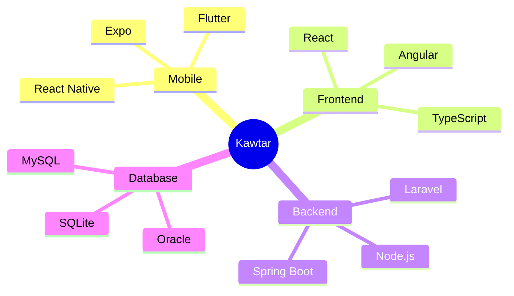

<!-- Header avec animation -->

  
### 👋 Bienvenue sur mon profil !

💼 **Développeuse Full Stack** chez **Jbel Nour** | 🎓 **Bac+2** en Développement Informatique  
💡 Passionnée par la création d'applications web et mobiles élégantes et performantes

---

## 💫 À Propos

<table>
<tr>
<td width="50%" valign="top">

### 🚀 Mon Parcours

Développeuse Full Stack passionnée, je transforme des idées en applications web et mobiles performantes. Avec une solide formation en développement informatique et une expérience professionnelle enrichissante chez **Jbel Nour**, je maîtrise l'art de créer des solutions complètes du frontend au backend.

</td>
<td width="50%" valign="top">

### 💡 Ma Vision

Je crois en la puissance du code élégant et des interfaces intuitives. Chaque projet est une opportunité d'apprendre, d'innover et de créer des expériences utilisateur exceptionnelles qui font la différence.

</td>
</tr>
</table>

### 🎯 Expertise Technique

**🌟 Spécialisations**

| Mobile Cross-Platform | Frontend Moderne | Backend Robuste | Architecture |
|:---:|:---:|:---:|:---:|
| React Native | React & Angular | Node.js & Laravel | Microservices |
| Flutter | TypeScript | Spring Boot | RESTful APIs |
| Expo | Tailwind CSS | Express.js | Base de données |

---

## 🛠️ Technologies & Outils

### Langages de Programmation

### Frameworks & Bibliothèques

### Frontend & Mobile

### Bases de Données

### Outils & Plateformes

---

## 📊 Statistiques GitHub

<picture>
  <source media="(prefers-color-scheme: dark)" srcset="https://github-readme-stats.vercel.app/api?username=kaouthar-el&show_icons=true&theme=tokyonight&hide_border=true&bg_color=0D1117&title_color=F85D7F&icon_color=F8D866&text_color=C9D1D9&ring_color=F85D7F&hide=contribs">
  
</picture>

<picture>
  <source media="(prefers-color-scheme: dark)" srcset="https://github-readme-streak-stats.herokuapp.com/?user=kaouthar-el&theme=tokyonight&hide_border=true&background=0D1117&ring=F85D7F&fire=F85D7F&currStreakLabel=F85D7F">
  
</picture>

### 📈 Activité & Langages

<picture>
  <source media="(prefers-color-scheme: dark)" srcset="https://github-readme-stats.vercel.app/api/top-langs/?username=kaouthar-el&layout=compact&theme=tokyonight&hide_border=true&bg_color=0D1117&title_color=F85D7F&text_color=C9D1D9&langs_count=8">
  
</picture>

<picture>
  <source media="(prefers-color-scheme: dark)" srcset="https://github-readme-activity-graph.vercel.app/graph?username=kaouthar-el&theme=tokyo-night&hide_border=true&bg_color=0D1117&color=F85D7F&line=F85D7F&point=F8D866">
  
</picture>

---

## 🏆 Réalisations

---

## 💼 Expérience Professionnelle

<table>
<tr>
<td align="center" width="100%">
  
**💻 Développeuse Full Stack** | Jbel Nour  
📅 *2024 - Présent* | 📍 Casablanca, Maroc

</td>
</tr>
</table>

<table>
<tr>
<td width="50%" valign="top">

### 🎯 Responsabilités

- 📱 Développement d'applications mobiles cross-platform
- 🌐 Création de sites web dynamiques et responsive
- 🎨 Design d'interfaces utilisateur modernes
- 🔧 Intégration d'APIs RESTful

</td>
<td width="50%" valign="top">

### 🛠️ Stack Technique

- **Mobile:** React Native, Flutter, Expo
- **Frontend:** React, Angular, TypeScript
- **Backend:** Node.js, Laravel, Spring Boot
- **Database:** MySQL, Oracle, SQLite

</td>
</tr>
</table>

---

## 🚀 Projets Épinglés

<table>
<tr>
<td width="50%" valign="top">

### 📂 [portfolio_](https://github.com/kaouthar-el/portfolio_)

Un portfolio moderne et responsive pour présenter mon parcours, mes compétences et mes projets. Interface élégante avec animations fluides et design contemporain.

**🔗 [Voir le projet →](https://github.com/kaouthar-el/portfolio_)**

</td>
<td width="50%" valign="top">

### 🎓 [Gestion-centre-de-formation](https://github.com/kaouthar-el/Gestion-centre-de-formation)

Projet de Gestion de Centre de Formation décomposé en trois microservices utilisant Spring Cloud et Lombok. Architecture microservices moderne et scalable.

**🔗 [Voir le projet →](https://github.com/kaouthar-el/Gestion-centre-de-formation)**

</td>
</tr>

<tr>
<td width="50%" valign="top">

### 💬 [portfolio_ChatBot](https://github.com/kaouthar-el/portfolio_ChatBot)

Backend développé avec Spring Boot pour gérer le chatbot IA. Fournit les API REST pour les questions du chatbot avec intelligence artificielle intégrée.

**🔗 [Voir le projet →](https://github.com/kaouthar-el/portfolio_ChatBot)**

</td>
<td width="50%" valign="top">

### 🏦 [Repartition-Base-Donnees-BANK-Oracle](https://github.com/kaouthar-el/Repartition-Base-Donnees-BANK-Oracle)

Système bancaire distribué avec Oracle 11g. Répartition automatique des données entre sites géographiques avec synchronisation PL/SQL avancée.

**🔗 [Voir le projet →](https://github.com/kaouthar-el/Repartition-Base-Donnees-BANK-Oracle)**

</td>
</tr>

<tr>
<td width="50%" valign="top">

### 🏫 [Gestion-administratif-d-un-college](https://github.com/kaouthar-el/Gestion-administratif-d-un-college)

Application Java de gestion administrative scolaire. Planification des salles, suivi des absences, gestion des élèves et enseignants avec interface Swing et MySQL.

**🔗 [Voir le projet →](https://github.com/kaouthar-el/Gestion-administratif-d-un-college)**

</td>
<td width="50%" valign="top">

### ✈️ [Agence-de-voyage--LAHRECH---FAKHAM---AZLAG-](https://github.com/kaouthar-el/Agence-de-voyage--LAHRECH---FAKHAM---AZLAG-)
 

Site web d'agence de voyage avec système de réservation en ligne. Interface utilisateur intuitive pour la recherche et réservation de voyages.

**🔗 [Voir le projet →](https://github.com/kaouthar-el/Agence-de-voyage--LAHRECH---FAKHAM---AZLAG-)**

</td>
</tr>
</table>

---

## 🎯 Objectifs Actuels

| 🚀 Apprentissage | 🔨 Projets | 🌟 Communauté |
|:---:|:---:|:---:|
| Microservices Architecture | Apps Cross-Platform | Open Source |
| Spring Cloud | Portfolio Personnel | Mentorat |
| DevOps & CI/CD | E-Commerce Platform | Tech Blogging |

---

### 📫 Me Contacter

Vous avez un projet en tête ? Une question ? N'hésitez pas à me contacter !

---

**✨ Créé avec 💖 par Kawtar Elmansouri**

